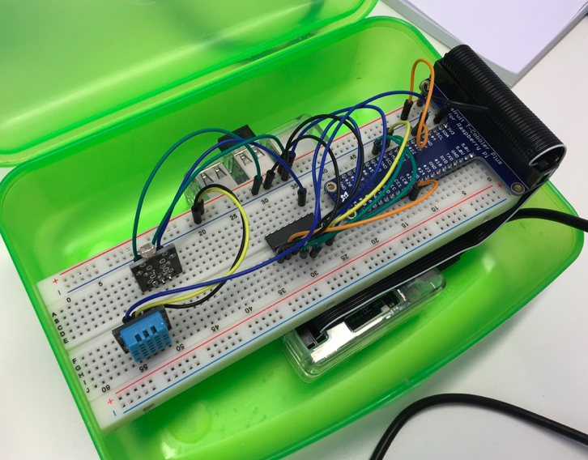

Raspberry Pi Erlang IoT Webserver
=====

Embedded Erlang webserver for reading values from analog and digital sensors and publishing to a Adafruit.io IoT-Dashboard.

Prerequisites - Hardware
----

- Raspberry 3B/2B
- Full size breadboard, [Buy from Adafruit](https://www.adafruit.com/products/239)
- Adafruit T-Cobbler Plus GPIO Breakout, [Buy from Adafruit](https://www.adafruit.com/products/2028)
- MCP3008 Analog to Digital Converter, [Buy from Adafruit](https://learn.adafruit.com/raspberry-pi-analog-to-digital-converters/mcp3008)
- Keyes DHT11 Digital temperature and humidity sensor, [Amazon](https://www.amazon.com/Digital-Temperature-Humidity-Sensor-Arduino/dp/B0100A9SZ2/ref=sr_1_cc_3?s=aps&ie=UTF8&qid=1465662964&sr=1-3-catcorr&keywords=keyes+dht11)
- Keyes Photo Resistor (light level sensor), [Amazon](https://www.amazon.com/HobbyKing-KY-018-resistor-Module-Arduino/dp/B01EE0WNZQ/ref=sr_1_2?s=toys-and-games&ie=UTF8&qid=1465663093&sr=1-2&keywords=keyes+photo+resistor)

Prerequisites - Software
-----

You must download and install [Erlang](https://www.erlang-solutions.com/home.html) in order to build and run this project.

For Raspberry Pi, you can download Erlang Mini (without gui packages) which is good for small embedded devices. Go to the [download page](https://www.erlang-solutions.com/resources/download.html), select "Raspbian" and follow the installation instructions.

To read values from sensors with Erlang, this project uses the [Erlang ALE module](https://github.com/esl/erlang_ale). I highly recommend you to follow the directions in the modules repository to test it in a local repo before integrating it in your own project.

The software tries to publish values to [Adafruit IoT Dashboard](https://io.adafruit.com), so you will need an account and a dashboard. You can read Jeremy Morgans great blog post [here](https://www.jeremymorgan.com/internet-of-things/how-to-adafruit-io/) on how to do that.

Wiring the Raspberry and the sensors
----

0. Start by connecting the Cobbler to the breadboard and then to the Raspberry PI
1. Wire the Analog-to-Digital Converter (ADC) according to [Adafruit's excellent guide](https://learn.adafruit.com/raspberry-pi-analog-to-digital-converters/mcp3008). On a Raspberry 3, you can wire the ADC directly to the hardware SPI interface (see a separat section in the guide for that).
2. Connect the Photo Resistor to channel 0 on the ADC.
3. Connect the DHT11 to GPIO #4
4. Git clone this repo and then build the code as described below.

Build
-----

    $ make distclean

    $ make

Starting the server
----

To start the release in the console:

    chmod u+x run.sh
    ./run.sh

or

    $ ./_rel/webserver/bin/webserver console

Testing the sensors from the Erlang Shell
----

After you have startet the server with one of the terminal commands above, you will be able to execute commands directly in the Erlang Shell:

    pi@raspberrypi3:~/erlang_raspberrypi_temperature_sensor $ ./run.sh 
    ....
    /home/pi/erlang_raspberrypi_temperature_sensor/_rel/webserver
    Erlang/OTP 18 [erts-7.3] [source] [smp:4:4] [async-threads:10] [kernel-poll:false]
    Eshell V7.3  (abort with ^G)
    (webserver@127.0.0.1)1>

Try running "mcp3008:readSPI(0)." to read a value from the light-level sensor:

    (webserver@127.0.0.1)1> mcp3008:readSPI(0).
    {
      "id": 649281259,
      "value": "116",
      "position": null,
      "lat": null,
      "lon": null,
      "ele": null,
      "feed_id": 592856,
      "group_id": null,
      "expiration": null,
      "completed_at": null,
      "created_at": "2016-06-12T11:57:21.688Z",
      "updated_at": "2016-06-12T11:57:21.688Z",
      "created_epoch": 1465732641.68893
    }

Try running "dht11:read()." to read and publish humidity and temperature values:

    (webserver@127.0.0.1)2> dht11:read().      
    {
      "id": 649260154,
      "value": "32.0",
      "position": null,
      "lat": null,
      "lon": null,
      "ele": null,
      "feed_id": 592854,
      "group_id": null,
      "expiration": null,
      "completed_at": null,
      "created_at": "2016-06-12T11:51:11.719Z",
      "updated_at": "2016-06-12T11:51:11.719Z",
      "created_epoch": 1465732271.71952
    }{
      "id": 649260167,
      "value": "26.0",
      "position": null,
      "lat": null,
      "lon": null,
      "ele": null,
      "feed_id": 592855,
      "group_id": null,
      "expiration": null,
      "completed_at": null,
      "created_at": "2016-06-12T11:51:11.935Z",
      "updated_at": "2016-06-12T11:51:11.935Z",
      "created_epoch": 1465732271.93519
    }

Accessing the sensors throught the embedded webserver
----
The embedded webserver's endpoints are coded in the file webserver_app.erl. Point your browser at http://localhost:8080/sensors/light to see output from the sensor (that is, if your Raspberry actually has a sensor connected).
